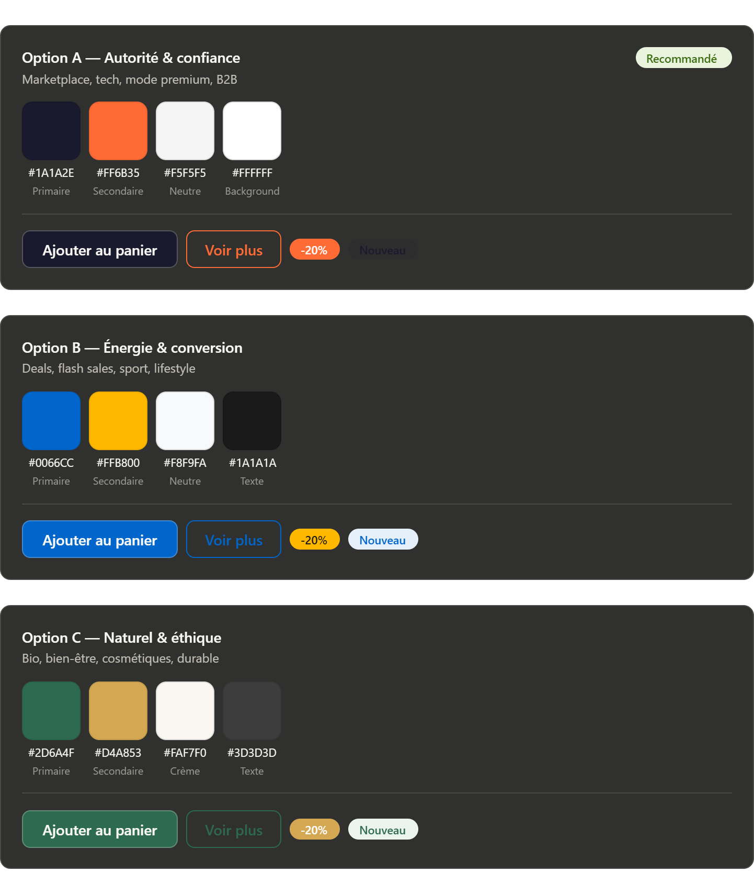

Crée une application e-commerce full-stack avec :

Frontend : Vue.js (Composition API) + Pinia + Vue Router

Backend : Laravel (API REST)

Authentification : Laravel Sanctum

Gestion des rôles / sécurité : Laravel Fortify
Interface utilisateur 
Interface admin
Interface livreur
🔐 EXIGENCES GLOBALES

Sécurité prioritaire et non négociable

Respect des bonnes pratiques (validation, sanitation, protection CSRF, XSS, SQL Injection)

Architecture propre (MVC côté Laravel, store structuré côté Vue)

Code clair, maintenable, modulaire

API RESTful propre (status codes, JSON standardisé)

🗄️ BASE DE DONNÉES (IMPORTANT)

👉 Tous les IDs doivent être en UUID v4 (natif Laravel)

Table users

id (UUID, PK)

name (string, max 30)

email (unique)

password (hash obligatoire)

profile_photo (image)

created_at

updated_at

Table roles

id (UUID, PK)

label (string)

👉 Insérer automatiquement :

admin

user

livreur

Table categories

id (UUID, PK)

label

Table products

id (UUID, PK)

name

price

image

quantity

description

category_id (FK)

created_at

Table favorites

id (UUID, PK)

user_id (FK)

product_id (FK)

created_at

Table orders

id (UUID, PK)

user_id (FK)

product_id (FK)

payment_date

delivery (boolean)

Table reviews

id (UUID, PK)

user_id (FK)

product_id (FK)

comment

rating (notation étoile)

created_at

🧠 BACKEND (LARAVEL)
🔑 Authentification

Sanctum (SPA Auth)

Fortify pour gestion auth avancée

Hash des mots de passe obligatoire

Middleware de protection des routes

🔐 Middleware à implémenter

Auth utilisateur

Vérification rôle (admin / user / livreur)

Protection :

achat

commandes

accès admin

📦 Fonctionnalités API
Utilisateur

inscription / connexion

profil utilisateur

Produits

CRUD (admin uniquement)

récupération liste produits

produits en promotion

Favoris

ajouter / supprimer

afficher favoris

Panier

ajouter produit

modifier quantité

supprimer produit

afficher panier

Commandes

passer commande

choisir livraison ou non

validation commande

Avis

laisser avis UNIQUEMENT si produit livré

notation étoilée + commentaire

🏭 Factory

créer des factories pour produits

🎨 FRONTEND (VUE.JS)
🧩 Structure globale
Interface CLIENT (2 niveaux)
1. Sidebar gauche (type moderne)

Navigation principale

Icônes visibles même en mode réduit

Sidebar rétractable (compacte avec icônes seulement)

Contenu :

Accueil

Produits

Favoris

Panier

Profil

2. Zone principale (contenu dynamique)

Affichage selon onglet sélectionné

Liste produits

détails produit

panier

commandes

🛒 Fonctionnalités CLIENT

Voir produits

Voir produits en promotion

Ajouter au panier

Modifier panier (quantité, suppression)

Ajouter aux favoris

Voir détails produit

Passer commande

Choisir livraison

Noter produit après livraison

🛠️ INTERFACE ADMIN

Dashboard professionnel

CRUD produits (avec images)

Voir liste utilisateurs

Voir commandes

Gestion livreurs (disponible / occupé)

🎨 DESIGN UI/UX
🎯 Style

Simple

Professionnel

Épuré

⚠️ INTERDICTIONS (IMPORTANT)

❌ pas de box-shadow excessif

❌ pas de transform au hover

❌ éviter les effets typiques IA

🌗 Thèmes

Implémenter :

Light mode

couleur principale : #FAF9F5

Dark mode

couleur principale : #212121

👉 Toggle entre les deux modes

📱 UX

responsive

navigation fluide

pas de reload inutile (SPA)

feedback utilisateur (loading, erreurs)

⚙️ EXIGENCES TECHNIQUES

Utiliser Pinia pour state management

API centralisée (service layer)

Validation front + backend

Gestion erreurs propre (UX)

🧠 BONUS (FORTEMENT RECOMMANDÉ)

Pagination produits

Recherche produits

Filtre par catégorie

Loader pendant requêtes

Toast notifications

📌 OBJECTIF FINAL

Construire une application :

robuste

sécurisée

professionnelle

prête à évoluer

TL;DR

👉 Tu construis un e-commerce complet avec :

Laravel API + Sanctum + Fortify

Vue.js + Pinia + Router

UUID partout

sécurité stricte

dashboard client + admin

design propre sans effets IA

dark/light mode

Palette de couleur :
#1A1A2E (Primaire)
#FF6B35 (Secondaire)
#F5F5F5 (Neutre)
#FFFFFF (Background)
